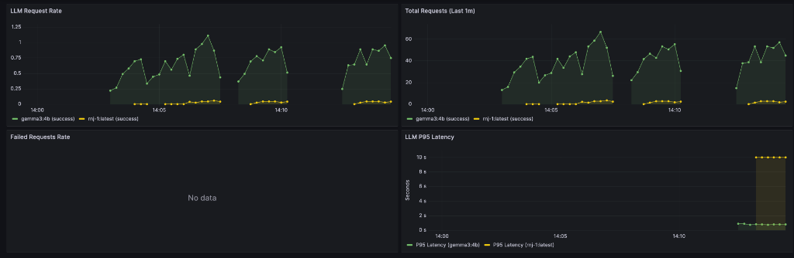
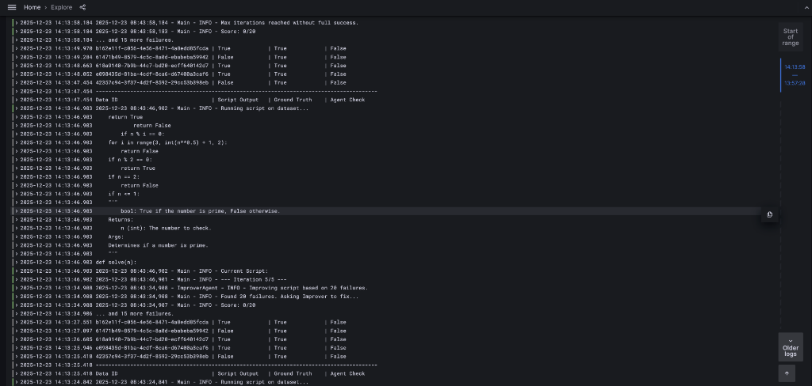

# Dual LLM Self-Correction Loop

A robust, self-improving code generation system powered by Local LLMs (via Ollama).
The system uses **two distinct agents** working in a feedback loop to write, test, and fix Python scripts until they satisfy a ground-truth dataset.



## 🏗️ Architecture

The system operates on a **Generate -> Evaluate -> Improve** loop:
1.  **Improver Agent (`rnj-1`)**: Writes the initial Python script.
2.  **Runner Sandbox**: Executes the script safely against a dataset (e.g., Prime Numbers).
3.  **Evaluator Agent (`gemma3:4b`)**: acts as the "Senior Engineer". It reviews the execution results (success/failure) and provides specific logical feedback.
4.  **Feedback Loop**: The Improver Agent receives the feedback and the failed test cases to rewrite the code.

This cycle continues until the script passes all tests or the maximum iteration limit is reached.

## 🚀 Features
- **Self-Healing Code**: Automatically fixes logical errors and edge cases.
- **Local LLM Support**: Privacy-first, offline-capable execution using **Ollama** and **LiteLLM**.
- **Observability Stack**: Integrated Grafana, Prometheus, and Loki for real-time monitoring.
- **Custom Metrics**: Tracks LLM Latency (P95), Request Rates, and Failure counts.
- **Dockerized**: specific `docker-compose` setup with hot-reload (`--watch`) for development.

## 🛠️ Prerequisites
- **Python 3.10+**
- **Docker & Docker Compose**
- **Ollama** installed and running (`ollama serve`).
- Models pulled:
  ```bash
  ollama pull rnj-1:latest
  ollama pull gemma3:4b
  ```

## 📦 usage

### Quick Start (Docker)
The recommended way to run the full stack (App + Observability).

1.  **Start the Stack**
    ```bash
    docker-compose -f deployment/docker-compose.yml up --build
    ```
    *Note: The app allows hot-reloading. You can edit files in `src/` and they will sync automatically if you use `docker-compose up --watch`.*

2.  **View Results**
    The app runs in the console, printing a clean table of results:
    ```text
    Data ID                              | Script Output   | Ground Truth    | Agent Check    
    ------------------------------------------------------------------------------------------
    37d0673f...                          | False           | True            | False
    ```

### Local Development
1.  **Install Dependencies**
    ```bash
    pip install -r requirements.txt
    ```
2.  **Run**
    ```bash
    python main.py
    ```
3.  **Configure**
    Edit `config.yaml` to change models, iteration limits, or logging levels.

## 📊 Observability & Monitoring

The project comes with a production-grade observability stack pre-configured.

### Grafana Dashboards
Access Grafana at [http://localhost:3000](http://localhost:3000) (User: `admin`, Pass: `admin`).

**LiteLLM Metrics Dashboard**:
Real-time tracking of your local LLMs performance.
- **Request Rate**: Requests per second per model.
- **P95 Latency**: How long the models take to generate responses (95th percentile).
- **Failures**: Tracks connectivity issues or model errors.

### Distributed Logs (Loki)
Logs are aggregated via Loki and viewable in Grafana Explore.



1.  Go to **Explore**.
2.  Select **Loki** datasource.
3.  Run query: `{container_name=~".*app.*"}`

*Note: You need the [Loki Docker Driver](https://grafana.com/docs/loki/latest/clients/docker-driver/) installed for log capture.*
```bash
docker plugin install grafana/loki-docker-driver:latest --alias loki --grant-all-permissions
```

## 📂 Project Structure
```text
.
├── deployment/          # Docker & Observability Configs
│   ├── config/          # Prometheus, Loki, Grafana provisioning
│   ├── Dockerfile
│   └── docker-compose.yml
├── docs/                # Documentation & Images
├── src/
│   ├── agents/          # LLM Agents (Evaluator, Improver)
│   ├── dataset/         # Problem definitions (Primes, etc.)
│   └── utils/           # Logistics (Runner, Logger, Config)
├── config.yaml          # Main configuration file
└── main.py              # Entry point
```
